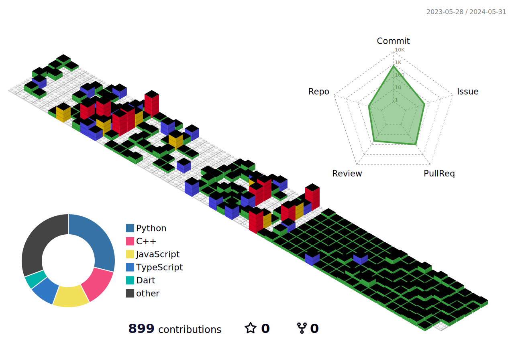

 

## Hi there 👋

### - 👀 Who am I

#### 🌟 majoring in **Computer Science & Engineering** at Chung-Ang University&nbsp; ( 2021.3 ~ )  

 
	
&nbsp; - **Cloud Club** &nbsp;&nbsp;&nbsp;&nbsp;- Vendor-Neutral IT Infra Union&nbsp;&nbsp;&nbsp;&nbsp;5th Member ( 2024.3 ~ 2024.7 ) 
&nbsp; - **OSSCA** &nbsp;&nbsp;&nbsp;&nbsp;&nbsp;&nbsp;&nbsp;&nbsp;&nbsp;&nbsp;&nbsp;- Open Source Contribution&nbsp;&nbsp;&nbsp;&nbsp;&nbsp;&nbsp;&nbsp;&nbsp;&nbsp;&nbsp;Lead Mentee&nbsp;&nbsp;&nbsp;&nbsp;|&nbsp;&nbsp;&nbsp; Azure Functions OpenAPI Extensions&nbsp; ( 2023.7 ~ 2023.11 ) 
&nbsp; - **CAU LikeLion** &nbsp;- IT Startup Club&nbsp;&nbsp;&nbsp;&nbsp;&nbsp;&nbsp;&nbsp;&nbsp;&nbsp;&nbsp;&nbsp;&nbsp;&nbsp;&nbsp;&nbsp;&nbsp;&nbsp;&nbsp;&nbsp;&nbsp;&nbsp;&nbsp;&nbsp;&nbsp;&nbsp;&nbsp;&nbsp;&nbsp;11th Member &nbsp;&&nbsp; 12th Management &nbsp;&nbsp;&nbsp;&nbsp;|&nbsp;&nbsp;&nbsp; Back-end&nbsp; ( 2023.3 ~ ) 
&nbsp; - **[CAU COMP](https://hnnynh.notion.site/COMP-7827b4f860d84427a5dbdbecdf36be5a?pvs=4)** &nbsp;&nbsp;&nbsp;&nbsp;- Web Dev. Club &nbsp;&nbsp;&nbsp;&nbsp;&nbsp;&nbsp;&nbsp;&nbsp;&nbsp;&nbsp;&nbsp;&nbsp;&nbsp;&nbsp;&nbsp;&nbsp;&nbsp;&nbsp;&nbsp;&nbsp;&nbsp;&nbsp;&nbsp;&nbsp;&nbsp;&nbsp;&nbsp;&nbsp;36th Member&nbsp; &&nbsp; 37th Vice-President&nbsp; ( 2022.3. ~ 2024.1 ) 
&nbsp; - **UMC** &nbsp;&nbsp;&nbsp;&nbsp;&nbsp;&nbsp;&nbsp;&nbsp;&nbsp;&nbsp;&nbsp;&nbsp;&nbsp;&nbsp;&nbsp;&nbsp;- Univ. Dev. Union Club&nbsp;&nbsp;&nbsp;&nbsp;&nbsp;&nbsp;&nbsp;&nbsp;&nbsp;&nbsp;&nbsp;&nbsp;&nbsp;&nbsp;&nbsp;&nbsp;&nbsp;2nd Member &nbsp;&nbsp;&nbsp;&nbsp;|&nbsp;&nbsp;&nbsp; Back-end - Node.js &nbsp; ( 2022.9 ~ 2023.2 ) 

 

 
### - 🌱 What I’m Interested in
#### 🌟 interested in Site Reliability Engineering & Cloud Engineering
 

 
  
</a>
</a>
</a>
</a>

</a>
</a>
</a>
</a>

 

### - 💬 What I’ve used ...

| 🌟 Cloud Services | 🌟 BackEnd/Database | Programming | Frontend/Mobile | Collaboration |
| -------------- | ------------------ | -------------------- | -------- | ------------- |
|        |      |       |      |    |

 

<!--
**hnnynh/hnnynh** is a ✨ _special_ ✨ repository because its `README.md` (this file) appears on your GitHub profile.

Here are some ideas to get you started:

### - :eyes: I'm
- 🔭 I’m currently working on ...
- 🌱 I’m currently learning ...
- 👯 I’m looking to collaborate on ...
- 🤔 I’m looking for help with ...
- 💬 Ask me about ...
- 📫 How to reach me: ...
- 😄 Pronouns: ...
- ⚡ Fun fact: ...
-->
